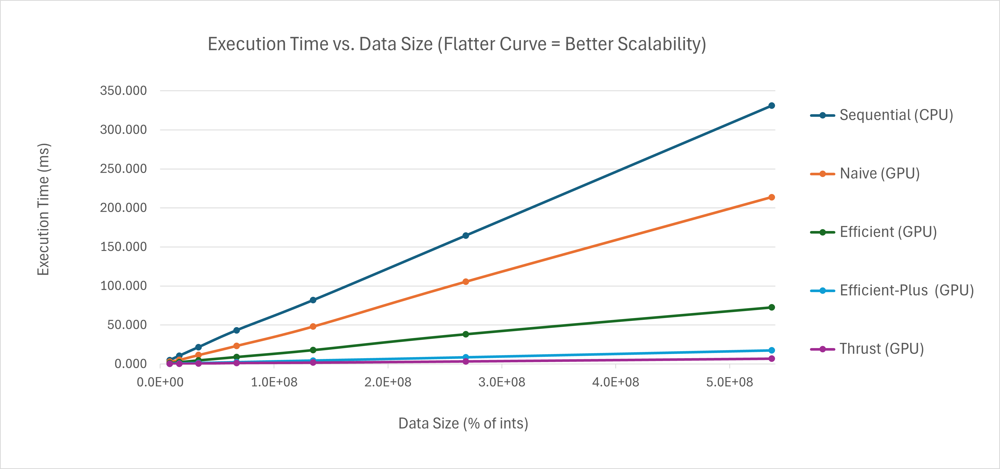
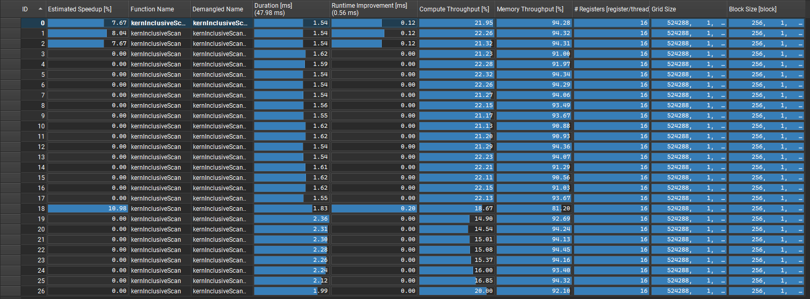
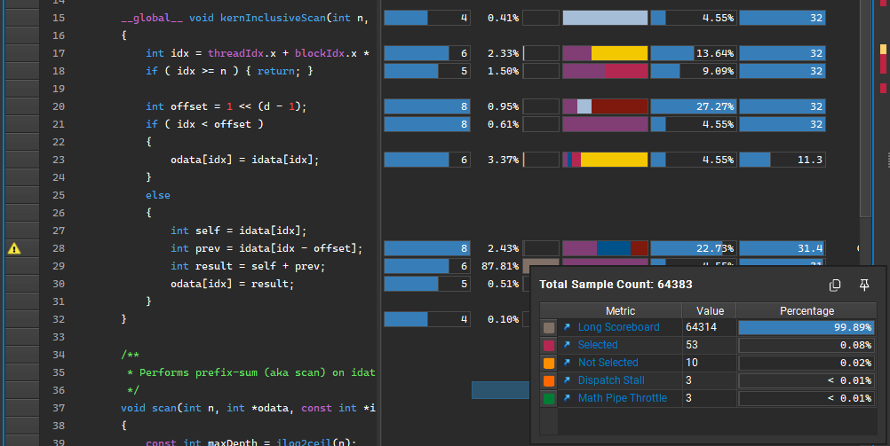
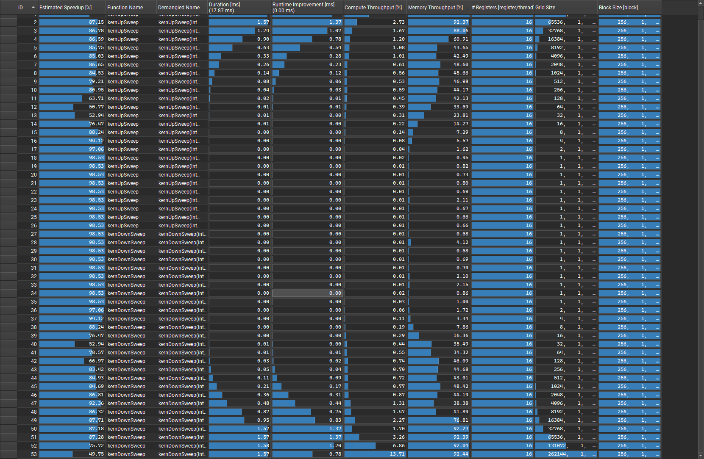
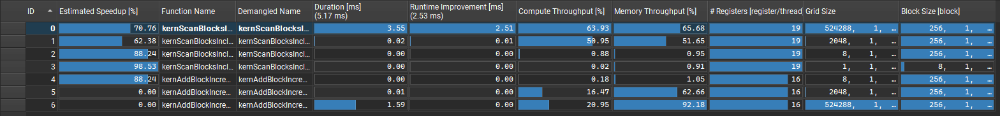
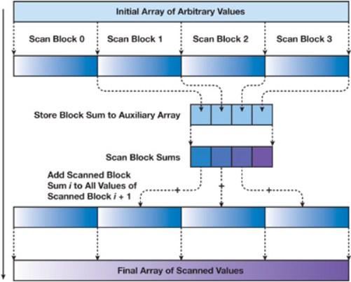
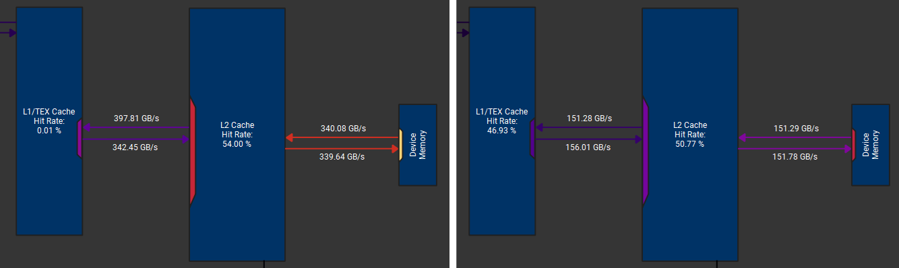

CUDA Stream Compaction
======================

**University of Pennsylvania, CIS 565: GPU Programming and Architecture, Project 2**

- Zhanbo Lin
    - [LinkedIn](https://www.linkedin.com/in/zhanbo-lin)
- Tested on: Windows 10, i5-10400F @ 2.90GHz 48GB, RTX-3080 10GB (Personal) 
- GPU Compute Capability: 8.6

## Project Description ##

In this project I implemented a few versions of prefix sum (scan) and stream compaction algorithm using both CPU and CUDA. I then benchmarked and compared their performance and scalability.

### Algorithm implementations ###
#### Scan ####
- __Sequential__: Straightforward sequential implementation (CPU)
- __Naive__: Basic parallel implementation (GPU) - "Stream Reduction Operations for GPGPU Applications." by Horn, Daniel in GPU Gems 2 
- __Efficient__: Work-efficient parallel implementation (GPU)
- __Efficient-Plus__: Work-efficient parallel implementation using shared memory to speed up (GPU) 
- __Thrust__: Implementation using NVIDIA’s Thrust library (GPU)

#### Stream Compaction ####
- __Sequential Compaction without Scan__: Straightforward sequential implementation (CPU)

- __Sequential Compaction with Scan__: Performs a sequential scan first, then uses the result for compaction (CPU)

- __Parallel Compaction__: Performs an __Efficient__ scan first, followed by compaction (GPU)

### Benchmarking Setup ###

Since scan does the heavy lifting in stream compaction, we benchmarked only the scan algorithm’s execution time with input sizes ranging from $2^{23}$ to $2^{28}$, and focused our performance analysis on it.

Each algorithm was executed 8 times, and the __average execution time__ was recorded.


## Performance Analysis ##

### Scan Algorithm Benchmarking Results (Execution Time by Data Size) ###


--- 

### Bottleneck Analysis of Different Implementations ###

#### Naive ####
It's the most computational expensive one among the prallel implementations, but it still suffers from imbalanced compute and memory throughput. Although the calculations are evenly distributed across kernel executions, the workload remains skewed toward memory throughput, causing long scoreboard stalling and impact performances.


<sub>Imbalance between compute and memory throughput</sub>  


<sub>Long scoreboard stalls due to global memory fetches</sub>  


#### Efficient ####
The work-efficient version makes uses of intermediate results and reduces the number of repetitive calculations, freeing more threads earlier and therefore scaling better with data size. 

However, it still suffers from the same problem of imbalanced compute and memory throughput. Most kernel invocations are filled with computationally light threads, causing poor utilization of available compute resources.

<sub>Imbalance between compute and memory throughput</sub>  


#### Efficient-Plus ####
This version builds on the work-efficient implementation. It pre-fetches data into shared memory  and do all levels of up-sweep and down-sweep whthin a single kernel call. This minimizes the data transfers between L1 cache and global memory, alleviating the long scoreboard stalls observed in the previous implementation.


<sub>Balanced compute and memory throughput</sub>  

It also supports inputs of arbitrary size by dividing the array into blocks and padding only the last block. Compared to the power-of-two padding required in previous versions, this greatly reduces unnecessary computations, especially for large data sizes. 


<sub>GPU Gems 3: Figure 39-6</sub>  

The potential improvement is to avoid the bank conflicts when read from shared memory. This can be done by adding a padding when reading and writing to the shared memory. 

In addition, to ensure block-level synchronization, my implementation will write the block increment array to the global memory before the next kernel call, and this data will be read in the next kernel call. There might be a better way to do it.


#### Thrust ####

The Thrust library’s implementation is more than twice as fast as the Efficient-Plus version. I think this is largely due to its higher memory throughput. 

Interestingly, the L1 cache hit rate is nearly zero, so I wonder what causes this.

  
<sub>Memory throughput comparison: Thrust (left) vs. Efficient-Plus (right)</sub>  

--- 
###  Sample Outputs ###
Measured with data size = $2^{26}$
```
****************
** SCAN TESTS **
****************
    [  16   1  47 ...  25   0 ]
==== cpu scan, power-of-two ====
   elapsed time: 51.5072ms    (std::chrono Measured)
    [   0  16  17 ... 1643369755 1643369780 ]
==== cpu scan, non-power-of-two ====
   elapsed time: 43.3375ms    (std::chrono Measured)
    [   0  16  17 ... 1643369691 1643369733 ]
    passed
==== naive scan, power-of-two ====
   elapsed time: 24.6601ms    (CUDA Measured)
    passed
==== naive scan, non-power-of-two ====
   elapsed time: 23.1905ms    (CUDA Measured)
    passed
==== work-efficient scan, power-of-two ====
   elapsed time: 9.14457ms    (CUDA Measured)
    passed
==== work-efficient scan, non-power-of-two ====
   elapsed time: 9.06283ms    (CUDA Measured)
    [   0  16  17 ... 1643369691 1643369733 ]
    passed
==== work-efficient-plus scan, power-of-two ====
   elapsed time: 2.25453ms    (CUDA Measured)
    passed
==== work-efficient-plus scan, non-power-of-two ====
   elapsed time: 2.2231ms    (CUDA Measured)
    passed
==== thrust scan, power-of-two ====
   elapsed time: 1.01891ms    (CUDA Measured)
    passed
==== thrust scan, non-power-of-two ====
   elapsed time: 1.02716ms    (CUDA Measured)
    passed

*****************************
** STREAM COMPACTION TESTS **
*****************************
==== cpu compact without scan, power-of-two ====
   elapsed time: 165.528ms    (std::chrono Measured)
    [   1   1   1 ...   3   1 ]
    passed
==== cpu compact without scan, non-power-of-two ====
   elapsed time: 167.281ms    (std::chrono Measured)
    [   1   1   1 ...   3   3 ]
    passed
==== cpu compact with scan ====
   elapsed time: 276.596ms    (std::chrono Measured)
    [   1   1   1 ...   3   1 ]
    passed
==== work-efficient compact, power-of-two ====
   elapsed time: 110.745ms    (CUDA Measured)
    [   1   1   1 ...   3   1 ]
    passed
==== work-efficient compact, non-power-of-two ====
   elapsed time: 11.9542ms    (CUDA Measured)
    [   1   1   1 ...   3   3 ]
    passed
```


